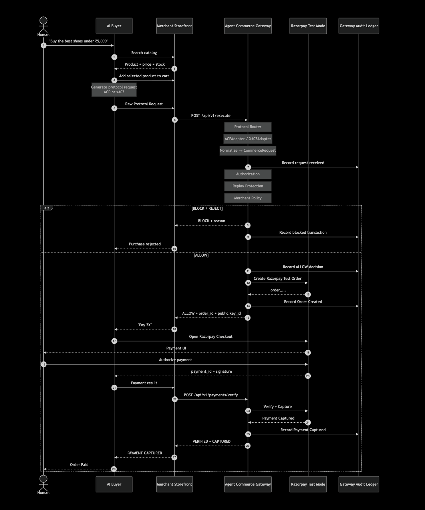
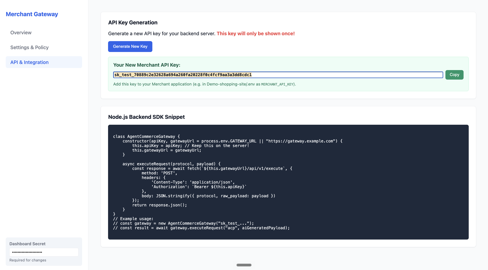
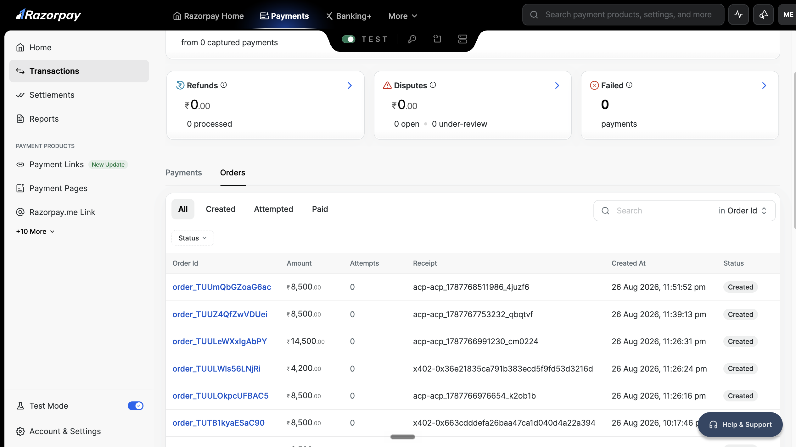
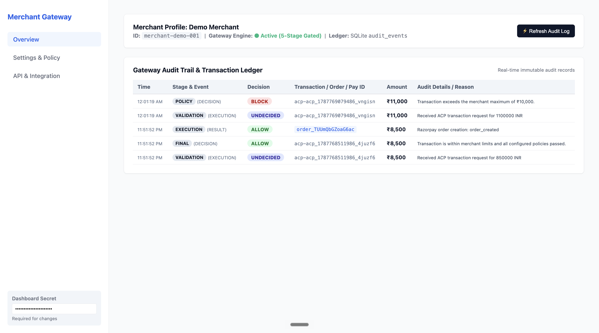
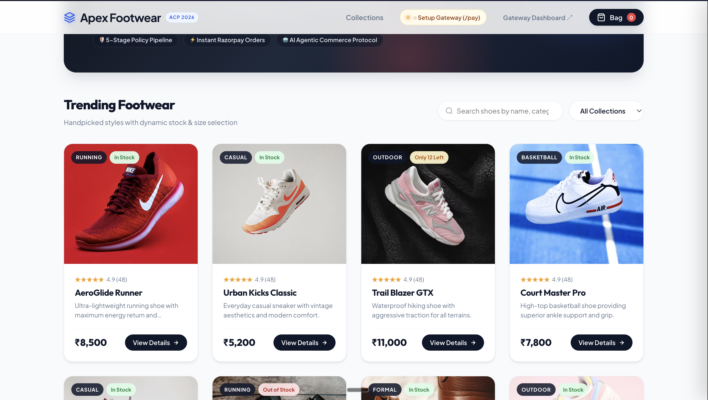
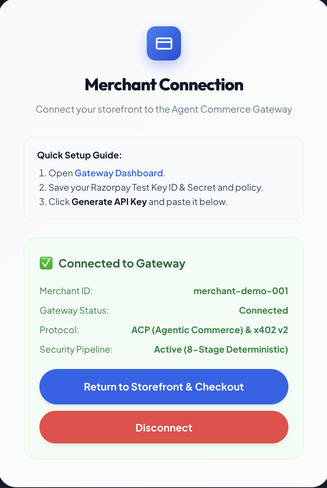

<div align="center">

# AI-Agent-Commerce-Gateway (Razorpay)

### Protocol-Agnostic Infrastructure for Agentic Commerce


</div>

<br>

## Abstract

Autonomous agents are beginning to transact on behalf of humans. Every emerging agentic-commerce standard — ACP, x402, and the protocols that will inevitably follow — defines its own request shape, its own authentication model, its own settlement assumptions. A merchant who wants to be reachable by AI buyers today is forced to either bet on a single protocol or maintain a growing pile of one-off integrations.

**AI Agent Commerce Gateway** removes that decision entirely. It is a transaction layer that sits between any AI buyer and any merchant, absorbs whatever protocol the buyer speaks, and reduces it to a single canonical representation before a single line of security or payment logic ever runs. Protocols become an input format. The gateway is the system of record.

This repository is not a proof of concept wired together to demo well. It is a working pipeline with adapter-level protocol isolation, a shared authorization and replay-protection layer, merchant-configurable policy enforcement, and live Razorpay settlement — backed by 380 passing tests across three independent codebases.

<br>

## System Architecture

The gateway is built as a layered pipeline. Every layer has exactly one responsibility, and no layer trusts the one before it.

```
                              ┌──────────────────────────────┐
                              │           AI BUYER            │
                              │   (Gemini-powered agent)      │
                              └───────────────┬───────────────┘
                                              │
                         speaks ACP  ─────────┼───────── speaks x402 v2
                                              │
                    ┌─────────────────────────▼─────────────────────────┐
                    │                PROTOCOL ADAPTER LAYER             │
                    │                                                   │
                    │     ACPAdapter                    X402Adapter     │
                    │  (parses, validates)          (parses, validates) │
                    └─────────────────────────┬─────────────────────────┘
                                              │
                                normalized into
                                              │
                                              ▼
                              ┌───────────────────────────────┐
                              │      CANONICAL COMMERCE       │
                              │           REQUEST             │
                              │  (protocol-independent model) │
                              └───────────────┬───────────────┘
                                              │
                    ┌─────────────────────────▼─────────────────────────┐
                    │                  SECURITY PIPELINE                │
                    │                                                   │
                    │   1. Schema Validation                            │
                    │   2. Authorization (identity, scope, signature)   │
                    │   3. Replay Protection (nonce /idempotency ledger)│
                    │   4. Merchant Policy Engine (limits, allow/deny)  │
                    └─────────────────────────┬─────────────────────────┘
                                              │
                                    ┌─────────┴─────────┐
                                    │                   │
                                 BLOCK                 ALLOW
                                    │                   │
                               rejected, logged      forwarded to
                               never reaches                │
                                 Razorpay                   ▼
                                              ┌───────────────────────┐
                                              │   RAZORPAY (TEST)     │
                                              │   order creation and  │
                                              │   settlement          │
                                              └───────────────────────┘
```

**Design principle:** protocol diversity is a parsing problem, not an architecture problem. Everything downstream of the adapter layer — authorization, replay protection, policy, settlement — operates on one shape of data, regardless of whether the request arrived as ACP or x402. Adding a new protocol means writing a new adapter, not touching the security or payment core.

## Workflow Architecture
<p align="center">
  
</p>

<br>

## Why a Canonical Model

Bolting protocol-specific logic onto a payment path is how commerce infrastructure quietly becomes unmaintainable. Every new protocol version, every new field, every new signature scheme leaks into business logic and multiplies the surface area for mistakes — especially the kind of mistake that costs a merchant money.

The gateway avoids this by treating protocol translation as its own bounded concern:

```
ACP request  ──►  ACPAdapter  ──┐
                                 ├──►  CommerceRequest  ──►  everything else
x402 request ──►  X402Adapter ──┘
```

The `CommerceRequest` is the only object the security pipeline, the policy engine, and the settlement layer ever see. This is the same architectural instinct behind payment-gateway abstractions like Stripe's unified charge object, or network-layer OSI separation: isolate volatility, keep the core stable.

<br>

## Core Capabilities

| Capability | Description |
|---|---|
| Protocol normalization | ACP and x402 v2 requests are parsed and reduced to one canonical model |
| Authorization | Identity, scope, and signature verification before any policy is evaluated |
| Replay protection | Nonce and idempotency ledger prevents duplicate or replayed transactions |
| Merchant policy engine | Per-merchant configurable limits and allow/deny rules, enforced server-side |
| Razorpay settlement | Live Test Mode order creation and execution on approval |
| Merchant SDK | Server-side SDK plus a merchant-issued gateway API key for integration |
| AI-readable storefront | A demo merchant site structured for autonomous agent discovery and purchase |
| AI Buyer agent | A Gemini-powered agent capable of generating and issuing protocol-correct requests |
| Live protocol inspector | Real-time view of a request's path from raw protocol to settlement decision |
| Audit rails | Every stage of the pipeline is logged for post-hoc inspection and compliance review |

<br>

## Security Pipeline in Detail

A request is never trusted by default. It earns forward progress one stage at a time, and failure at any stage terminates the transaction before Razorpay is ever invoked.

```
Request
   │
   ▼
Protocol Validation ─── malformed or unrecognized requests rejected immediately
   │
   ▼
Normalization ────────── converted to CommerceRequest regardless of source protocol
   │
   ▼
Authorization ────────── identity and signature must be valid for the claimed scope
   │
   ▼
Replay Protection ────── nonce checked against ledger, duplicate transactions blocked
   │
   ▼
Merchant Policy ──────── spend limits, merchant-defined rules, allow/deny evaluation
   │
   ▼
ALLOW ──► Razorpay Test Mode order creation
BLOCK ──► rejected and logged, no funds movement possible
```

<br>

## Supported Protocols

| Protocol | Status | Notes |
|---|---|---|
| ACP | Supported end-to-end | Full ingestion, normalization, and settlement path |
| x402 v2 | Supported for processing and normalization | Ingestion, validation, and gateway processing |
| AP2 | Experimental | Not yet part of the supported transaction path |

> x402 support in this gateway covers protocol ingestion, validation, and normalization into the canonical model. This project does not claim to be an independent on-chain settlement network.

<br>

## Repository Structure

```
ai-agent-commerce-gateway/
│
├── agent-commerce-gateway/        Protocol normalization, security pipeline,
│                                   policy engine, Razorpay execution
│
├── Demo-shopping-site/            AI-readable merchant storefront and cart
│
├── Ai-Buyer/                      AI shopping agent and protocol request generation
│
└── public/                        Architecture diagrams and product screenshots
    ├── Workflow.png
    ├── merchant-sdk.png
    ├── razorpay-demopass.png
    ├── sdk-merchantconnection.png
    ├── audit-rails.png
    └── store.png
```

Three independently testable systems, one coherent transaction contract between them.

<br>

## Merchant Integration

```
Configure Razorpay credentials
            │
            ▼
Define merchant policy (limits, rules)
            │
            ▼
Generate gateway API key
            │
            ▼
Install server-side SDK
            │
            ▼
Accept AI commerce requests
```

Merchant gateway credentials and Razorpay secrets never leave the backend. No client-side code path has visibility into either.

<br>

## Live Protocol Inspector

The AI Buyer interface exposes the full lifecycle of a transaction as it happens:

```
Raw Protocol Payload
        │
        ▼
Canonical CommerceRequest
        │
        ▼
Security Pipeline (stage by stage)
        │
        ▼
Decision (ALLOW / BLOCK)
        │
        ▼
Razorpay Order (if approved)
```

This is not a static diagram in the product — it is a live, per-transaction trace, useful for debugging, demonstration, and audit.

<br>

## Test Status

```
Agent Commerce Gateway      359 passed
AI Buyer                     15 passed
Demo Merchant Store           6 passed
--------------------------------------
Total                       380 passed
```

Every layer of the pipeline — adapters, canonical model, authorization, replay protection, policy engine, and settlement — is covered independently.

<br>

## Project Gallery

<p align="center">
  
  
</p>

<p align="center">
  
  
</p>

<p align="center">
  
</p>

<br>

## Cloning and Setup

### Requirements

- Python 3
- Node.js
- npm
- Razorpay Test Mode credentials
- Gemini API key

### Clone

```bash
git clone https://github.com/merajstack/ai-agent-commerce-gateway.git
cd ai-agent-commerce-gateway
```

### Install

```bash
cd agent-commerce-gateway
python3 -m venv .venv
.venv/bin/pip install -r requirements.txt

cd ../Ai-Buyer
npm install

cd ../Demo-shopping-site
npm install
```

### Configure

Create a `.env` file in each project directory with the credentials it requires — Razorpay Test Mode keys for the gateway and demo store, and a Gemini API key for the AI Buyer. Never commit any of the following:

```
.env
.env.local
API keys
Razorpay secrets
private keys
```

### Run Tests

```bash
cd agent-commerce-gateway && .venv/bin/pytest
cd ../Ai-Buyer && npm test
cd ../Demo-shopping-site && npm test
```

### Run Locally

```bash
# Terminal 1 — Gateway
cd agent-commerce-gateway && .venv/bin/python run.py

# Terminal 2 — Demo Merchant Store
cd Demo-shopping-site && node server.js

# Terminal 3 — AI Buyer
cd Ai-Buyer && node server.js
```

<br>

## Design Goal

> Different AI commerce protocols. One canonical transaction model. One merchant integration.

The gateway is built on the belief that agentic commerce will not converge on a single protocol any time soon — and that merchants should not have to bet on which one wins. Protocol diversity is absorbed at the edge. Everything that matters — security, policy, settlement — runs once, correctly, regardless of how the request arrived.

<div align="center">

<br>

**Built for agent-driven commerce.**

</div>
