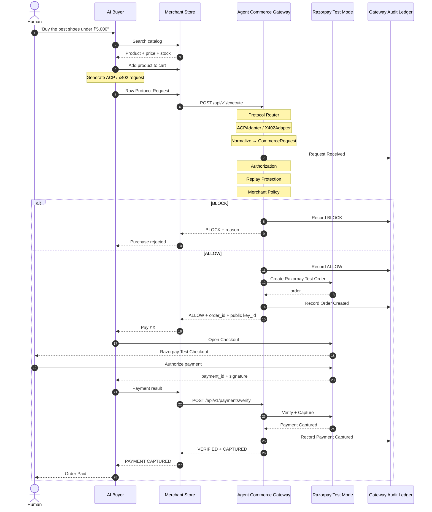

````markdown
<div align="center">

# AI Agent Commerce Gateway

### Protocol-Agnostic Infrastructure for Agentic Commerce

<p>


</p>

</div>

---

## Overview

**AI Agent Commerce Gateway** is a protocol-agnostic transaction layer for agentic commerce.

AI buyers can speak different commerce protocols. Merchants should not have to rebuild their payment integration for every new protocol.

This gateway converts protocol-specific requests into one canonical commerce model, runs a deterministic security and policy pipeline, and executes approved transactions through Razorpay Test Mode.

```text
ACP / x402
     │
     ▼
Protocol Adapter
     │
     ▼
Canonical CommerceRequest
     │
     ├── Authorization
     ├── Replay Protection
     ├── Merchant Policy
     │
     ▼
ALLOW / BLOCK
     │
     ▼
Razorpay Test Mode
     │
     ▼
Payment Captured
````

---

## End-to-End Architecture



---

## The Core Idea

Different protocols produce different request shapes.

The gateway isolates that difference at the adapter boundary:

```text
ACP ───────► ACPAdapter ───────┐
                               │
x402 ──────► X402Adapter ──────┼──► CommerceRequest
                               │
Future ─────► New Adapter ─────┘
```

From that point onward, the same authorization, replay, policy, and payment execution pipeline is reused.

---

## What Is Included

### Gateway

* ACP protocol adapter
* x402 v2 protocol adapter
* Canonical `CommerceRequest`
* Authorization checks
* Replay protection
* Merchant policy engine
* Razorpay Test Mode execution
* Merchant dashboard
* Merchant API key generation
* Server-side SDK
* Live audit / pipeline visibility

### AI Buyer

* ChatGPT-style shopping interface
* Gemini-powered agent
* Product search and selection
* Cart actions
* ACP protocol generation
* x402 protocol generation
* Raw protocol inspector
* Canonical request inspector
* Security pipeline visualization

### Demo Merchant

* AI-readable shoe catalog
* Product search
* Product details
* Cart management
* Merchant-side gateway integration

---

## Live Normalization Inspector

The demo makes the core transformation visible:

```text
RAW PROTOCOL
      │
      ▼
PROTOCOL ADAPTER
      │
      ▼
CANONICAL CommerceRequest
      │
      ▼
SECURITY PIPELINE
      │
      ▼
RAZORPAY
```

For example:

```text
ACP `buyer.agent_id`
        ↓
CommerceRequest `buyer_agent_id`

ACP `items[].unit_amount`
        ↓
CommerceRequest `items[].unit_amount_minor`

Protocol merchant identity
        ↓
CommerceRequest `merchant_id`
```

x402 follows the same downstream model even though its incoming representation is different.

---

## Repository Structure

```text
ai-agent-commerce-gateway/
│
├── agent-commerce-gateway/
│   ├── app/
│   │   ├── adapters/
│   │   │   ├── acp_adapter.py
│   │   │   ├── acp_provider.py
│   │   │   ├── x402_adapter.py
│   │   │   └── x402_provider.py
│   │   ├── api/
│   │   │   ├── gateway.py
│   │   │   ├── dashboard.py
│   │   │   └── dashboard.html
│   │   ├── core/
│   │   │   ├── orchestrator.py
│   │   │   ├── merchant_store.py
│   │   │   ├── policy.py
│   │   │   ├── replay.py
│   │   │   └── schemas.py
│   │   └── razorpay/
│   │       └── client.py
│   ├── sdk/
│   │   └── agent_commerce_gateway.js
│   └── tests/
│
├── Demo-shopping-site/
│   ├── public/
│   ├── server.js
│   └── test/
│
└── Ai Buyer/
    ├── public/
    ├── src/
    │   ├── gemini.js
    │   ├── protocols/
    │   │   ├── acp.js
    │   │   └── x402.js
    │   └── tools/
    ├── server.js
    └── test/
```

---

## Protocol Status

| Protocol | Status                                               |
| -------- | ---------------------------------------------------- |
| ACP      | Supported end-to-end                                 |
| x402 v2  | Supported for protocol processing and normalization  |
| AP2      | Experimental / not in the supported transaction path |

> x402 support here covers protocol ingestion, validation, normalization, and gateway processing. This project does not claim independent on-chain x402 settlement infrastructure.

---

## Test Status

```text
Agent Commerce Gateway     359 passed
AI Buyer                    15 passed
Demo Merchant Store          6 passed
---------------------------------------
Total                      380 passed
```

---

## Run

Start the three applications from their respective directories using the existing project environments.

The demo flow is:

```text
Human
  ↓
AI Buyer
  ↓
ACP / x402
  ↓
Merchant Store
  ↓
Agent Commerce Gateway
  ↓
Canonical CommerceRequest
  ↓
Security + Merchant Policy
  ↓
Razorpay Test Mode
  ↓
Payment Captured
```

---

## Design Principle

> **Different AI commerce protocols. One canonical transaction model. One merchant integration.**

---

<div align="center">

### Built for the transition from human-driven checkout to agent-driven commerce.

</div>
```
# ai-agent-commerce-gateway
# ai-agent-commerce-gateway
